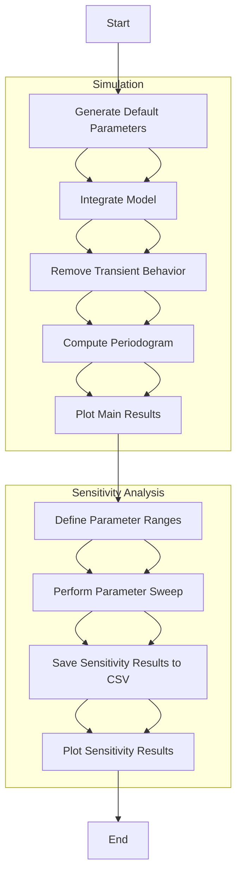

# Circadian Clock Simulation

This repository contains a Python implementation of a circadian clock simulation based on the Goodwin model. It includes functionality for parameter sweep and sensitivity analysis, with results exported to a CSV file.

## Structure

- `circadian_clock/`: Contains the core modules for the simulation.
  - `model.py`: Defines the ODE model.
  - `simulation.py`: Handles the numerical integration of the model.
  - `analysis.py`: Provides functions for normalizing oscillations, computing periodograms, performing parameter sweep, and saving results.
  - `plotting.py`: Contains plotting functions for visualizing results.
- `scripts/`: Contains scripts to run simulations and analyses.
  - `run_simulation.py`: Main script to run the simulation and sensitivity analysis.
- `README.md`: This file.

## Usage

### Setup

1. Clone the repository:

    ```bash
    git clone https://github.com/yourusername/circadian_clock_simulation.git
    cd circadian_clock_simulation
    ```

2. Install required packages:

    ```bash
    pip install numpy scipy matplotlib
    ```

### Running the Simulation

To run the simulation and sensitivity analysis, execute the following command:

```bash
python scripts/run_simulation.py
```

## Model
X = CLK/BMAL (e-box activity)

Y = PER/tr-CRY mRNA

Z = PER/tr-CRY proteins (inhibitor complex)

S = REV-ERB protein

W = CWO protein

b = basal CLK/BMAL activation

dW = positive effect of CWO

$$
\frac{dX}{dt} = \nu_1 (\frac{K_1^{hill}}{K_1^{hill} + Z^{hill} + S^{hill} + W^{hill}}) (b + cX +dW) - \nu_2(\frac{X}{K_2+X})
$$


$$
\frac{dY}{dt} = \nu_3X (\frac{K_3^{hill}}{K_3^{hill} + W^{hill}}) - \nu_4\frac{Y}{K_4+Y}
$$

$$
\frac{dZ}{dt} = \nu_5Y - \nu_6\frac{Z}{K_6+Z}
$$

$$
\frac{dR}{dt} = \nu_7X - \nu_8\frac{R}{K_7+R}
$$

$$
\frac{dS}{dt} = \nu_9R - \nu_10 \frac{S}{K_8+S}
$$





